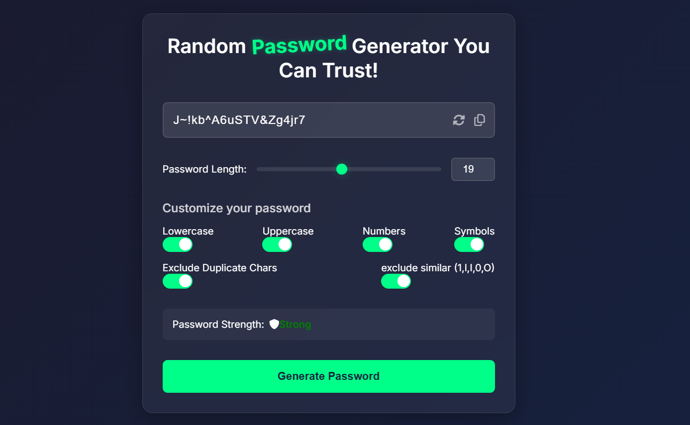

# Advanced Password Generator

## Overview
The **Advanced Password Generator** is a highly secure and feature-rich web tool built with HTML, CSS, and JavaScript. It allows users to generate strong, customizable passwords with advanced security options, ensuring maximum protection for online accounts.

## Features
- **Customizable Password Length** – Set desired password length using a slider.
- **Character Selection** – Include/exclude lowercase, uppercase, numbers, and symbols.
- **Exclude Similar Characters** – Avoid confusing characters like `i, l, 1, o, O, 0`.
- **Prevent Duplicate Characters** – Ensure each character appears only once.
- **Real-Time Strength Analysis** – Displays password strength as Weak, Medium, or Strong.
- **Auto-Copy to Clipboard** – Quickly copy generated passwords with a single click.
- **Instant Password Regeneration** – Regenerate passwords with ease.
- **Live Synchronization** – Slider and numeric input remain in sync.
- **Secure Password Evaluation** – Uses a scoring system to assess password strength.
- **User Notifications** – Displays notifications for password copy action.

## Technologies Used
- **HTML** – Builds the structural foundation.
- **CSS** – Enhances UI/UX for a visually appealing experience.
- **JavaScript** – Implements interactive functionalities and password generation logic.

## Usage
1. Adjust the password length using the slider.
2. Select character options: lowercase, uppercase, numbers, symbols.
3. Enable additional filters like duplicate removal and similar character exclusion.
4. Click the **Generate Password** button.
5. Copy the password to the clipboard using the copy button.

## Future Enhancements
- Store generated passwords securely.
- Implement a dark mode UI.
- Add multi-language support.
- Introduce advanced encryption for password storage.

## License
This project is licensed under the **MIT License**.